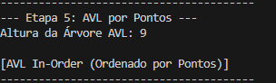

# 📄 RELATÓRIO FINAL: ESTRUTURA DE DADOS

## Análise e Implementação de Estruturas de Dados e Algoritmos

**Centro Universitário SENAI, Santa Catarina**

**Curso:** Bacharel em Ciência de Dados e Inteligência Artificial
**Unidade Curricular:** Estrutura de Dados
**Docente:** Paulo Felipe Salviano Brandt
**Data:** [Inserir Data]

---

### 1. Arquitetura e Modelagem do Projeto

O projeto segue uma arquitetura modular em Python, priorizando a **Separação de Preocupações (SRP)**. Cada módulo em `src/` é dedicado a uma funcionalidade específica, garantindo código limpo e manutenível. O `main.py` atua como orquestrador, executando as etapas de 2 a 6.

#### 1.1. Modelagem de Dados (`src/data_structs.py`)

* **Classe `Team`:** Representa uma seleção com `name` e `score`.
* **Classe `Match`:** Armazena dados de uma partida. Foi decidido armazenar os nomes dos times em vez de objetos `Team` no `__init__` para **facilitar a leitura e o filtro inicial do CSV** (Etapa 2), usando a classe `Team` apenas para agregação e ordenação posterior.

> **Justificativa da Escolha (Etapa 2):** A estrutura de dados primária para a carga de partidas (`matches`) é a **Lista** (`List`). Esta escolha é justificada pela sua eficiência na **inserção** de novos objetos (complexidade $O(1)$ amortizado) para o processamento sequencial de um grande volume de dados.

---

### 2. Análise Assintótica e Justificativas (Big O)

Abaixo está a análise de complexidade de tempo (*Big O*) para as principais operações do projeto.

#### 2.1. Complexidade das Estruturas e Algoritmos

| Estrutura / Algoritmo | Operação | Complexidade (Caso Médio) | Complexidade (Pior Caso) |
| :--- | :--- | :--- | :--- |
| **Lista Simples** | Inserção | $O(1)$ | $O(1)$ |
| **Merge Sort** (`sorting.py`) | Ordenação | $O(n \log n)$ | $O(n \log n)$ |
| **Bubble Sort** (`sorting.py`) | Ordenação | $O(n^2)$ | $O(n^2)$ |
| **Busca Binária** (`search.py`) | Busca | $O(\log n)$ | $O(\log n)$ |
| **BST** (Simples) | Inserção / Busca | $O(\log n)$ | $O(n)$ |
| **AVL** (Balanceada) | Inserção / Busca | $O(\log n)$ | **$O(\log n)$** |

#### 2.2. Comparação Teórica: BST (Etapa 3) vs AVL (Etapa 5)

A **BST Simples** é eficiente no caso médio, mas se degrada para complexidade $O(n)$ no pior caso (dados inseridos em ordem), comportando-se como uma lista encadeada.

> 

[Image of Binary Search Tree structure]

A **Árvore AVL** garante desempenho **$O(\log n)$** mesmo no pior cenário. Na Etapa 5, a AVL foi populada com a lista de times já **ordenada** pelo Merge Sort (Etapa 4), o que seria o pior caso para uma BST. A AVL lida com essa inserção desfavorável através de **rotações** (LL, RR, LR, RL), como o exemplo abaixo, mantendo sua altura balanceada.

> 

[Image of AVL tree showing left rotation]

---

### 3. Detalhamento das Etapas e Resultados

#### 3.1. Etapa 2: Leitura do CSV e Filtragem

A função `carregar_partidas_csv` trata a leitura, conversão de tipos (data, score) e filtragem de dados ausentes ou inválidos.

* **Tratamento de Dados Faltantes:** Linhas com valores ausentes em campos essenciais (`home_team`, `home_score`, `date`, etc.) foram **descartadas**.
* **Resultados de Carga:**
    * Total de partidas carregadas: **[Inserir valor do print]**
    * Total de linhas filtradas (dados faltantes/inválidos): **[Inserir valor do print]**
    * [Captura de tela da Etapa 2]

#### 3.2. Etapa 3: Implementação das BSTs

Duas BSTs foram criadas: uma ordenada por **Nome do Time** (para busca alfabética) e outra ordenada por **Gols Totais Acumulados** (conforme requisito).

#### 3.3. Etapa 4: Ordenação e Geração de Ranking

O **Merge Sort ($O(n \log n)$)** foi utilizado para ordenar a lista de `Team` por **Pontos Acumulados**. O **Bubble Sort ($O(n^2)$)** também foi implementado.

* **Top 10 Seleções com MAIS pontos (Merge Sort):** [Inserir Print]
* **Top 10 Seleções com MENOS pontos (Merge Sort):** [Inserir Print]
    * [Captura de tela da Etapa 4 - Rankings]

#### 3.4. Etapa 5: AVL por Pontos

A AVL foi populada com a lista ordenada de pontos para demonstrar o auto-balanceamento.

* **Altura da Árvore AVL:** [9]
    * 

#### 3.5. Etapa 6: Geração do CSV de Resumo

O resumo das partidas foi gravado em `output/matches_summary.csv` utilizando o formato obrigatório: `year,country,home_team,away_team,score`.

#### 3.6. Demonstração dos Algoritmos de Busca

* **Busca na BST ($O(\log n)$):** Busca eficiente por nome de time.
* **Busca Linear ($O(n)$):** Demonstração da busca mais lenta em lista desordenada.
* **Busca Binária ($O(\log n)$):** Demonstração da busca rápida em lista **ordenada** por score.
    * [Captura de tela da Demonstração das Buscas]

---

### 4. Contribuição dos Membros

| Nome | Contribuição | Assinatura |
| :--- | :--- | :--- |
| **[Nome do Aluno 1]** | [Detalhar contribuição (Ex: Implementação das classes Match/Team e BST).] | |
| **[Nome do Aluno 2]** | [Detalhar contribuição (Ex: Implementação da AVL e Lógica de Pontuação).] | |
| **Filipe Schweitzer** | Etapa 5 implementar AVL e Etapa 6 | |
| **[Nome do Aluno 4]** | [Detalhar contribuição (Ex: Implementação dos Algoritmos de Busca e Geração de CSV).] | |
| **[Nome do Aluno 5]** | [Detalhar contribuição (Ex: Elaboração e revisão final do Relatório e Análise Assintótica).] | |